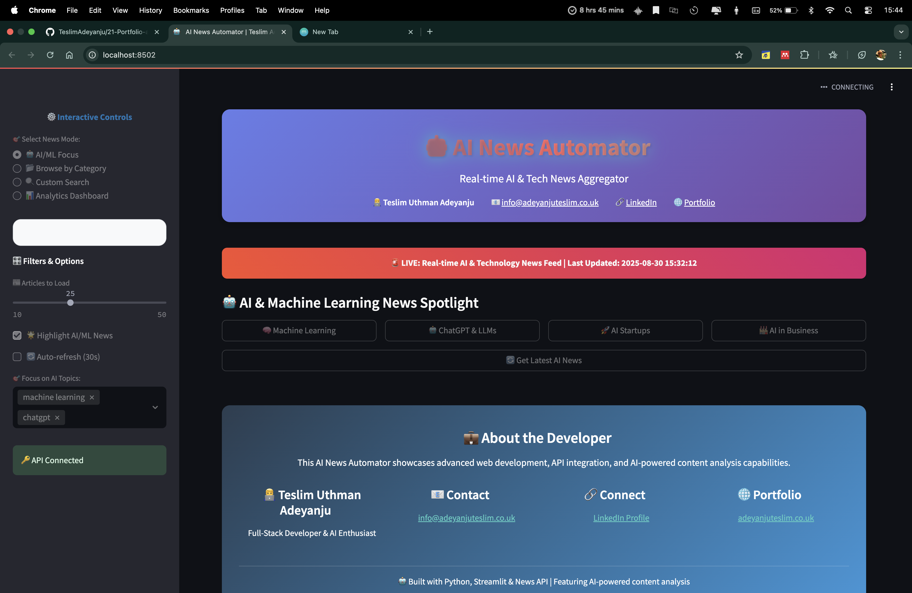

# � NewsFlow AI - Smart News Aggregator Dashboard

A cutting-edge real-time news aggregation platform powered by Python and Streamlit, delivering personalized news experiences with intelligent search and seamless API integration.


## 📸 Application Preview



*The News Automator interface showcasing real-time news aggregation with clean, professional design*

## 🚀 Features

- **Real-time News Fetching**: Get the latest news from multiple categories
- **Smart Search**: Search for specific topics across all news sources
- **News Sources**: Browse available news sources by category
- **Professional UI**: Clean, responsive design perfect for portfolio showcase
- **Error Handling**: Robust error handling for API failures
- **Configurable**: Adjustable number of articles to display

## 🛠️ Technologies Used

- **Python 3.8+** - Core programming language
- **Streamlit** - Interactive web application framework
- **News API** - Real-time news data source
- **Requests** - HTTP library for API calls
- **python-dotenv** - Environment variable management
- **Pandas** - Data manipulation and analysis

## 📦 Installation

1. **Clone the repository**
   ```bash
   git clone <your-repo-url>
   cd Port
   ```

2. **Install dependencies**
   ```bash
   pip install -r requirements.txt
   ```

3. **Set up environment variables**
   Create a `.env` file in the project root:
   ```env
   API_KEY=your_news_api_key_here
   ```
   
   Get your free API key from [NewsAPI.org](https://newsapi.org/register)

4. **Run the application**
   ```bash
   streamlit run streamlit_news_app.py
   ```

5. **Open your browser**
   Navigate to `http://localhost:8501`

## 🎯 Usage

The application provides an intuitive interface for accessing real-time news content (see screenshot above).

### Browse by Category
- Select from 7 news categories: Business, Entertainment, General, Health, Science, Sports, Technology
- Adjust the number of articles to display (5-50)
- Click "Fetch News" to get the latest articles

### Search News
- Enter any search term (e.g., "AI", "technology", "sports")
- Get relevant articles from all sources
- Results include article titles, descriptions, and direct links

### View Sources
- Browse available news sources by category
- See source descriptions and direct links
- Discover new reliable news outlets

## 🏗️ Project Structure

```
Port/
├── streamlit_news_app.py    # Main Streamlit application
├── news_automator.py        # Core news fetching logic
├── requirements.txt         # Python dependencies
├── .env                     # Environment variables (create this)
└── README.md               # This file
```

## 🔧 Core Functions

### `get_articles_by_category(category, max_articles=20)`
Fetches top headlines for a specific category.

### `get_articles_by_query(query, max_articles=20)`
Searches for articles matching a specific query.

### `get_news_sources(category)`
Retrieves available news sources for a category.

## 🎨 UI Features

- **Responsive Design**: Works on desktop and mobile devices
- **Professional Styling**: Custom CSS for a polished look
- **Interactive Components**: Sidebar configuration and dynamic content
- **Error Handling**: User-friendly error messages
- **Portfolio Ready**: Includes project information and tech stack

## 📊 API Integration

This project integrates with the [News API](https://newsapi.org/) to provide:
- Top headlines by category
- Search functionality across all sources
- Source information and metadata
- Real-time data updates

## 🚀 Deployment Options

### Local Development
```bash
streamlit run streamlit_news_app.py
```

### Production Deployment
Deploy to platforms like:
- **Streamlit Cloud** (recommended)
- **Heroku**
- **AWS/GCP/Azure**
- **Docker containers**

## 🔐 Environment Variables

| Variable | Description | Required |
|----------|-------------|----------|
| `API_KEY` | Your News API key | Yes |

## 📝 License

This project is part of a portfolio and is available for educational and demonstration purposes.

## 👨‍💻 Developer

**Teslim** - Portfolio Project

- Demonstrates full-stack development skills
- Shows API integration capabilities
- Exhibits modern Python web development
- Highlights UI/UX design abilities

## 🤝 Contributing

This is a portfolio project, but feedback and suggestions are welcome!

## 📞 Contact

For questions about this project or collaboration opportunities, please reach out!

---

*Built with ❤️ using Python and Streamlit*